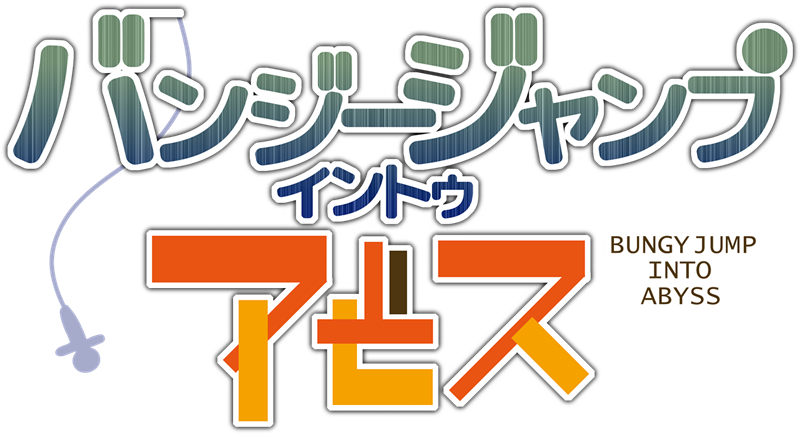
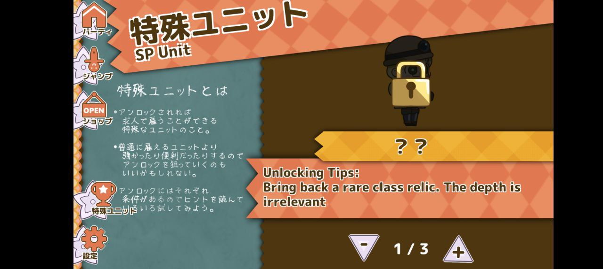
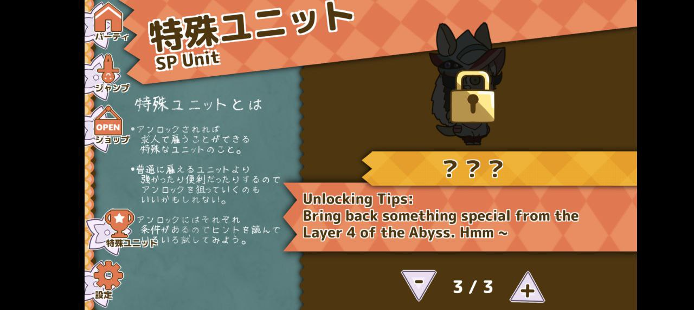
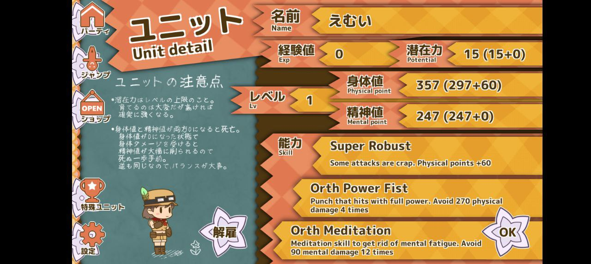
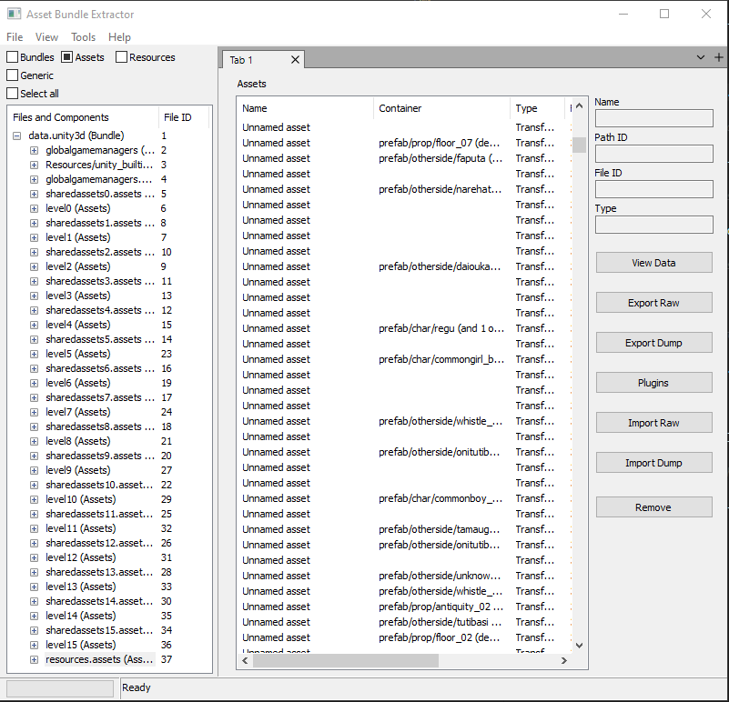
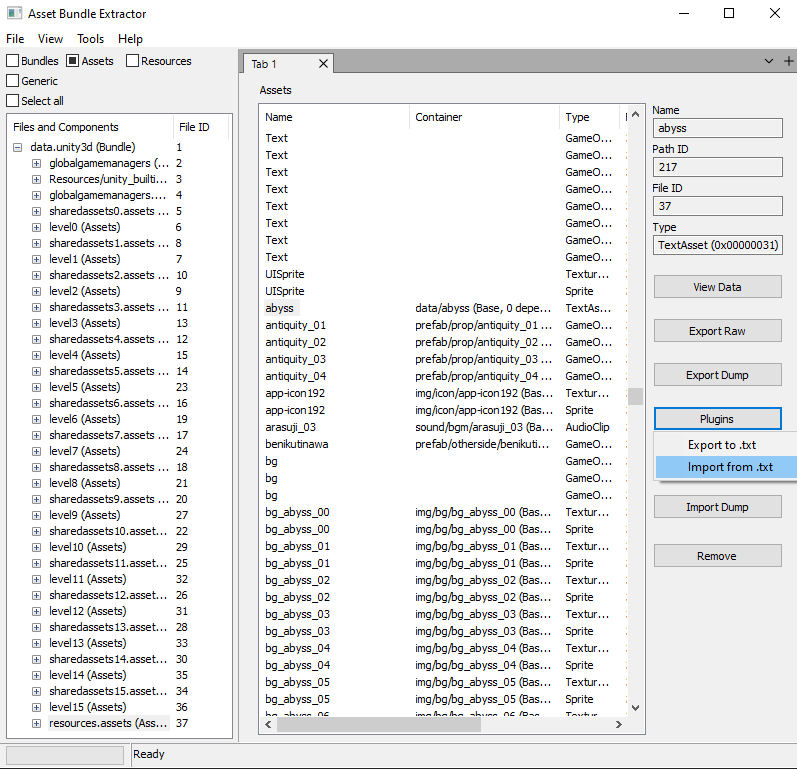

# バンジージャンプ イントゥ アビス - English translation



English translation project for the `メイドインアビス (Made in Abyss)` based game `バンジージャンプ イントゥ アビス (Bungy Jump Into Abyss)`.

The game is available for Android and PC Windows.

Official website: [https://kokoromati.orz.hm/bjia/](https://kokoromati.orz.hm/bjia/)

## Progress

- ✔️ All items, explorer' skills, abyss' events, special unit's description have been translated.

- ❌ The image assets (blackboard-like background images) have been found in the extracted files but they have not been translated yet.

- ❌ The menu/UI texts have not been found yet in the extracted files.

## Preview








## Requirements

Please note that this procedure is based on `Windows 10` and `Powershell`.

- [Java JDK/JRE](https://www.oracle.com/java/technologies/downloads/): needed to run Apktool
- [AssetBundleExtractor](https://github.com/SeriousCache/UABE): needed to manually patch the Unity assets
- (optional) [AssetStudio](https://github.com/Perfare/AssetStudio): can be used to easily navigate the Unity assets
- [APKsigner](https://developer.android.com/studio/command-line/apksigner): needed to sign the APK
- (optional) [Makefile](https://community.chocolatey.org/packages/make): needed to sign the APK

## Patch the Android version

1. Extract the original APK file `.\original.apk` using the already included software `Apktool` (more info [here](https://ibotpeaches.github.io/Apktool/documentation/)):

    ```powershell
    java -jar .\apktool.jar d .\original.apk -o .\extracted_apk
    ```

    or

    ```powershell
    make unpack
    ```

2. From `AssetBundleExtractor` go to `File -> Open` and select the file `.\extracted_apk\assets\bin\Data\data.unity3d`. Select a folder to save the uncompressed files (you can use the current folder `.\`).

    Select the element `resources.assets (Assets)` as shown below:

    

    Search and patch the text assets. To patch a text asset you have to select it and then `Plugin -> Import from .txt` selecting the appropriate translated file from the folder `.\translation_files\en\`.

    

    The files to be patched are the following:

    - abyss
    - event
    - item
    - skill
    - spchar

    When all the files are patched go to `File -> Apply and Save All`. Replace the original file `.\extracted_apk\assets\bin\Data\data.unity3d` with the modded one. Keep the same name otherwise it will not work.

    Additionally you can change the app name by opening the file `extracted_apk\res\values\strings.xml` and replacing

    ```xml
    <string name="app_name">バンジージャンプ イントゥ アビス</string>
    ```

    with

    ```xml
    <string name="app_name">Bungy Jump Into Abyss</string>
    ```

3. Generate the APK file from the modified files (more info [here](https://ibotpeaches.github.io/Apktool/documentation/)):

    ```powershell
    java -jar .\apktool.jar b .\extracted_apk\ -o .\build\packed.apk
    ```

    or

    ```powershell
    make pack
    ```

4. Execute the `zipalign` command to optimize the APK (more info [here](https://developer.android.com/studio/command-line/zipalign)):

    ```powershell
    zipalign -v 4 .\build\packed.apk .\build\aligned.apk
    ```

    or

    ```powershell
    make align
    ```

5. Generate a self-signed key to sign the APK (more info [here](https://developer.android.com/studio/publish/app-signing#certificates-keystores)):

    ```powershell
    keytool -genkey -v -keystore key.keystore -alias apk_key -keyalg RSA -keysize 2048 -validity 36500
    ```

    or

    ```powershell
    make generate-key
    ```

    When asked to input some information you can leave it blank and press ENTER. You don't have to choose a complex password unless you plan to re-use this key for other projects.

6. Sign the APK with the already generated key (more info [here](https://developer.android.com/studio/command-line/apksigner)):

    ```powershell
    apksigner sign -v --out .\build\signed.apk --ks .\key.keystore --ks-key-alias apk_key .\build\aligned.apk
    ```

    or

    ```powershell
    make sign
    ```

    Enter the password when asked.

The English patched APK file will be located in `.\build\signed.apk`.

## Patch the PC Windows version

1. Extract the file `.\original_installers\BungyJumpIntoAbyss.zip`.

2. From `AssetBundleExtractor` go to `File -> Open` and select the extracted file `.\BungyJumpIntoAbyss_Data\resources.assets`.
    Follow the same procedure used for the Android version (step 2.) to patch the text assets.
    When all the files are patched go to `File -> Apply and Save All`. Replace the original file `.\BungyJumpIntoAbyss_Data\resources.assets` with the modded one. Keep the same name otherwise it will not work.

Note: gamesave will be located in `C:\Users\{USER}\AppData\LocalLow\kokoromati\バンジージャンプ イントゥ アビス`.

## Cheat mode

It is possible to modify the text assets to add a special item that gives invulnerability against all entities in the Abyss (except the final unknown entity found below depth 15500m).

To add this item you need to modify the file `.\translation_files\en\item.txt` by adding the following code:

```json
    {
        "id":"item-godmode",
        "name":"God Mode",
        "desc":"Invincible. Exp. multiplier. Shared exp. Time relic selection.",
        "buy":1,
        "sell":9999999,
        "avertDrowning":true,
        "avertSickness":true,
        "avertCursing":true
        "fixPP":99999,
        "fixMP":99999,
        "ratioAvertMenPower":100.0,
        "ratioAvertPhyPower":100.0,
        "ratioPPDamageEvent":0.01,
        "ratioMPDamageEvent":0.01,
        "ratioMPCureEvent":10.0,
        "ratioExp":1000.0,
        "avertPhysical":999999,
        "avertMental":999999,
        "shareExp":1.0,
        "percentTakeout":100,
        "selectTime":5.0,
    }
```

You also need to add this item in the in-game shop by modifying the file `.\translation_files\en\shopProduct.txt` and including an extra element in the list:

```json
    {"shopProducts":[
        "item-ツルハシ",
        "item-良いツルハシ",
        "item-最高のツルハシ",
        "item-石灯",
        "item-良い石灯",
        "item-最高の石灯",
        "item-予防接種",
        "item-酸素ボンベ",
        "item-白笛レプリカ",
        "item-辛子饅頭",
        "item-行動食４号",
        "item-ヒガ油",
        "item-電気椅子",
        "item-godmode"
    ]}
```
